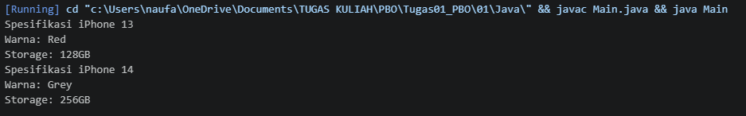
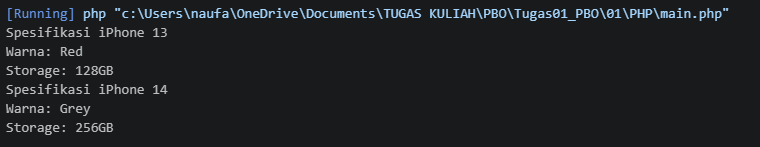
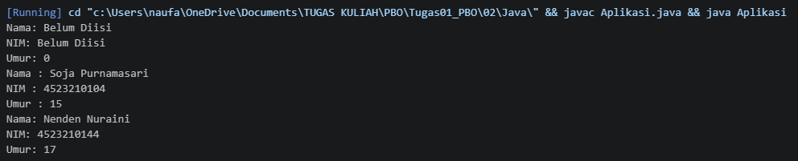
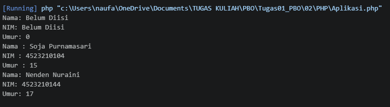

# PEMROGRAMAN BERORIENTASI OBJEK


## Biodata
Nama    : Naufalino Ahmad Saputra <br>
NPM     : 4525210139 <br>
Prodi   : Tekntik Informatika <br>

## Materi Pembelajaran
1. Class dan Object
2. Encapsulation dan Constructor
3. Inheritance dan Method Overriding
4. Polimorfisme
5. Asosiasi, Agregasi, dan Komposisi
6. Abstract Class dan Interface

## Deskripsi Tugas
**Tujuan:**
Mengubah (mengonversi) program Java yang telah dipelajari menjadi program PHP, sambil memahami konsep dasar Pemrograman Berorientasi Objek (PBO) pada Class dan Object.

## Struktur Folder
```
.
├── README.md
├── 01/
│   ├── java/
│   │   ├── iPhone.java
│   │   ├── Main.java
│   └── php/
│       ├── iPhone.php
│       ├── main.php
├── 02/
│   ├── java/
│   │   ├── Aplikasi.java
│   │   ├── Mahasiswa.java
│   └── php/
│       ├── Aplikasi.php
│       ├── Mahasiswa.php
├── 03/
│   ├── java/
│   │   ├── BangunDatar.java
│   │   ├── Lingkaran.java
│   │   ├── Persegi.java
│   │   ├── Segitiga.java
│   │   ├── App.java
│   │   ├── Mahasiswa.java
│   │   ├── MahasiswaInternational.java
│   │   └── Main.java
│   └── php/
│       ├── BangunDatar.php
│       ├── App.php
│       ├── Mahasiswa.php
│       ├── MahasiswaInternational.php
│       └── Main.php
├── 04/
│   ├── java/
│   │   ├── Handphone.java
│   │   ├── Smartphone.java
│   │   ├── FeaturePhone.java
│   │   └── Main.java
│   └── php/
│       ├── Handphone.php
│       ├── Smartphone.php
│       ├── FeaturePhone.php
│       └── Main.php
├── 05/
│   ├── java/
│   │   ├── Dokter.java
│   │   ├── Pasien.java
│   │   ├── Pemain.java
│   │   ├── Tim.java
│   │   ├── Bab.java
│   │   ├── Buku.java
│   │   └── Main.java
│   └── php/
│       ├── Dokter.php
│       ├── Pasien.php
│       ├── Pemain.php
│       ├── Tim.php
│       ├── Bab.php
│       ├── Buku.php
│       └── Main.php
└── 06/
    ├── java/
    │   ├── Movable.java
    │   ├── Fuelable.java
    │   ├── Vehicle.java
    │   ├── Car.java
    │   ├── Boat.java
    │   ├── Motor.java
    │   ├── Building.java
    │   └── Main.java
    └── php/
        ├── Movable.php
        ├── Fuelable.php
        ├── FuelableDefault.php
        ├── Vehicle.php
        ├── Car.php
        ├── Boat.php
        ├── Motor.php
        ├── Building.php
        └── Main.php
```

## Tugas 01 - Class dan Object
### Hasil Running Java

### Hasil Running PHP



## Tugas 02 - Encapsulation dan Constructor
### Hasil Running Java

### Hasil Running PHP


## Tugas 02 - Encapsulation dan Constructor
### Hasil Running Java

### Hasil Running PHP
